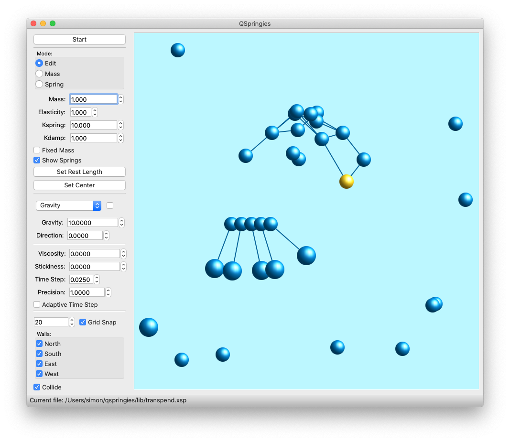

README file for QSpringies 1.0
==============================

QSpringies is a mass and spring simulation system. It is implemented in C++
using the Qt framework. My motivation for writing it was to learn about Qt
programming. 

QSpringies is based on XSpringies 1.12 by Douglas M. DeCarlo.
Much of the source code is recognisably derived from that of XSpringies,
but it has been extensively revised, and of course all of the original Xlib
code has been replaced. Like the original, QSpringies is licensed under the
GPL (see LICENSE for details).

The lib subdirectory contains the example files that came with the original
source code. The "Open" option on the File menu will load an XSpringies file.
The "Start" button on the control panel to the left of the window kicks off the
simulation. The other controls alter parameters such as mass, elasticity,
magnitude of forces and so on.

Building QSpringies
-------------------
The file qspringies.pro can be used to build QSpringies with Qt Designer or
to generate a Makefile with qmake. Obviously you'll need to install Qt first!

Installing QSpringies
---------------------
There is no installer as yet.

Further info
------------
The file xspringies.pdf was generated from the man page included with the
XSpringies source code. Most of it is still applicable to QSpringies. Perhaps
one day I'll write an updated user manual, but for now this will have to do.

Simon J. Saunders, February 2020
